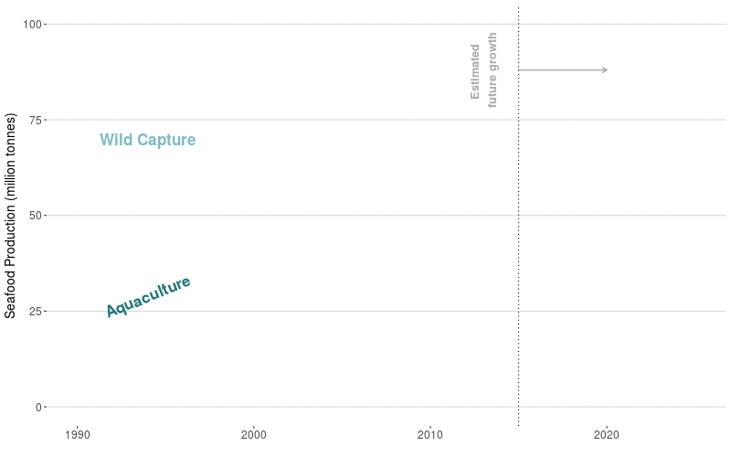

This script makes an animated .gif of seafood growth overtime. Specifically, seafood from wild-capture (caught in the open ocean) and farmed seafood. This will be incorporated in the [CART](http://www.cart-sci.org/) storymap.

```{r setup, message=F, warning=F}

knitr::opts_chunk$set(message = FALSE, warning = FALSE)

library(ggplot2)
library(gganimate)
library(tweenr)
library(ggthemes)
library(zoo)
library(tidyverse)
```

# Data wrangling

I start with data downloaded from [FAO's website](http://www.fao.org/fishery/statistics/global-production/en), specifically the "Total Production" dataset CSV. One problem with using this dataset to understand how seafood production from Wild Capture and Aquaculture has grown over time, is that this data does not differentiate between fish caught for consumption versus non-consumption (e.g. fish used for feed). 

```{r data}

#this data identifies aquaculture vs wild capture production
source <- read_csv("data/GlobalProuction_2017.1.1/CL_FI_PRODUCTION_SOURCE.csv")

#this is the time series data for global production (does not discern b/w seafood and nonseafood)
fao <- read_csv("data/GlobalProuction_2017.1.1/TS_FI_PRODUCTION.csv")

## species info
spp <- read_csv("data/GlobalProuction_2017.1.1/CL_FI_SPECIES_GROUPS.csv") %>%
  mutate(Species = `3Alpha_Code`) 
```

By using a second dataset on global food supply of fish/seafood, I can calculate the amount of fish caught for consumption. Why not only use this dataset? Because it does not differentiate between wild capture and aquaculture. 

If you're interested in the data I used, here is a screenshot of the manual query on [FAOSTAT](http://www.fao.org/faostat/en/#data/CL).


I am still hopeful that someone, somewhere will create an FAO R package that lets me query all of their data for what I want. 


```{r}

## read in the seafood data queried from FAOSTAT and get totals per year
seafood <- read_csv("data/FAOSTAT_data_12-21-2017.csv") %>%
  group_by(Year) %>%
  summarize(sf_tons = sum(Value))

```


## Calculate annual capture and aquaculture production

Since no dataset from FAO has exactly what I want, I can take the `seafood` dataset, calculate total production (tons) per year, and then remove the total aquaculture production each year calculated from the `fao` dataset. Then I have wild capture seafood per year (from the `seafood` dataset), and aquaculture prodution per year (from the `fao` dataset). This isn't perfect by any means and assumes that all aquaculture in these datasets is being used for human consumption (although I do remove aquatic plants from the Aquaculture dataset).


```{r}

data <- fao %>%
  left_join(spp) %>%
  mutate(source = 
           case_when(
             Source %in% c(1,2,3,5) ~ "Aquaculture",
             Source == 4 ~ "Wild_Capture"
           )) %>%
  filter(Major_Group != "PLANTAE AQUATICAE") %>% #removing aquatic plants
  mutate(source = as.factor(source)) %>%         #doing this for tweenr...still don't know why we need to
  group_by(source, Year) %>%
  summarize(tons = sum(Quantity, na.rm = T)/1000000) %>%
  filter(Year > 1989) %>%                        #only interested in showing 1990 onwards
  spread(source, tons) %>%
  left_join(seafood, by = "Year") %>%
  mutate(Wild_for_food = (sf_tons/1000000) - Aquaculture) %>% #subtract aquaculture from seafood series to get wild capture for seafood
  filter(!is.na(Wild_for_food)) %>%
  select(Year, Aquaculture, Wild_for_food)

```

## Forecast production values

The data only goes to 2015, but I want to include forecasted growth of these two sectors. The 2016 [State of the Worlds Fisheries and Aquaculture report](http://www.fao.org/publications/sofia/2016/en/) projects a 39% growth in Aquaculture production and just a 1% growth in Wild-Capture. To make this easy, I simply used the 2015 production values and set the 2025 values to 139% and 101% of those values. 

```{r}

#forecast forward to 2025
#Projected 1% of growth in wild capture by 2025
#projected 39% for aquaculture

yrs <- data.frame(Year = 2014:2024,
                  Aquaculture = NA,
                  Wild_for_food = NA)

data_2025 <- data.frame(Year = 2025,
                        Aquaculture = 1.39*last(data$Aquaculture),
                        Wild_for_food = 1.01*last(data$Wild_for_food))

plot_data <- data %>%
  rbind(yrs, data_2025) %>%
  mutate(Aquaculture = na.approx(.$Aquaculture),
         Wild_for_food = na.approx(.$Wild_for_food)) %>%
  gather(source, tons, Aquaculture, Wild_for_food)%>%
  mutate(ease = "linear",
         x = Year) %>%
  rename(y = tons,
         id = source,
         time = Year)

```

# Making the plot

## Static ggplot

Just plotting the data to see if it looks right.

```{r}

static_plot <- ggplot(plot_data, aes(x = time, y = y)) +
  geom_line(aes(color = id), show.legend = F) +
  labs(x = "Year",
       y = "Seafood Production (million tonnes)") +
  theme_minimal()

static_plot
```

## Animate with `gganimate`

Trying out gganimate and changing up the colors
```{r, eval=F}

dynam_plot <- ggplot(plot_data, aes(x = x, y = y, cumulative = TRUE, frame = time)) +
  geom_line(aes(color = id), show.legend = F) +
  labs(x = "Year",
       y = "Seafood Production (million tonnes)") +
  theme_hc() +
  scale_y_continuous(breaks = seq(0, 100, by = 25)) +
  scale_color_manual(values = c("#24757A", "#7FBAC0")) +
  ylim(0, 100) +
  theme_hc() 

gganimate(dynam_plot, filename = "fao_gganimate.gif", title_frame = F)

```


## With `tweenr`

To make the animation smoother, I'm using the `tweenr` package. By using the `tween_elements()` function, which in my understanding creates a bunch of in be"tween" points in the dataset, allowing the animated graph to look super smooth.

```{r, fig.width = 6, fig.height = 6, eval=F}

data_tween <- plot_data %>%
  tween_elements(., "time", "id", "ease", nframes = 100) %>%   #using tweenr!
  mutate(year = round(time), id = .group) %>%
  left_join(plot_data) %>%
  mutate(period = ifelse(time < 2018, "current", "projected"))

tween_plot <- ggplot(data_tween, aes(x = x, y = y, frame = .frame, color = id)) +
  geom_path(aes(group = id, cumulative = T), size = 1, show.legend = F) +
  xlab("") +
  ylab("Seafood Production (million tonnes)") +
  scale_y_continuous(breaks = seq(0, 100, by = 25)) +
  scale_color_manual(values = c("#24757A", "#7FBAC0")) +
  ylim(0, 100) +
  theme_hc() +
  theme(axis.title.y = element_text(size=14),
        axis.text.y = element_text( size=12),
        axis.text.x = element_text(size = 12)) +
  annotate(geom = "text", x = 1994, y = 29, label = "Aquaculture", 
         cex = 6, angle = 22, fontface = "bold", color = "#24757A") +
  annotate(geom = "text", x = 1994, y = 70, label = "Wild Capture", 
         cex = 6, fontface = "bold", color = "#7FBAC0") +
  geom_segment(aes(x=2015,xend=2020, y=88, yend=88),arrow=arrow(length=unit(0.2,"cm")),show.legend=F, color = "darkgray") +
  annotate(geom = "text", x = 2013, y = 88, label = "Estimated \nfuture growth", color= "darkgray", fontface = "bold", cex = 4.5, angle = 90) +
  geom_vline(xintercept=c(2015), linetype="dotted"); tween_plot

gganimate(tween_plot, title_frame = FALSE, interval = 0.05, "fao_aq_capture_fig.gif", ani.width = 800, ani.height = 500)
```



PERFECT!

